# Navigation Diagrams & Visual Flowcharts

Complete visual documentation of the post-authentication navigation system, role-based routing, and dashboard flows in the Tuitional LMS Frontend.

---

## Table of Contents

1. [Complete Authentication & Navigation Flow](#complete-authentication--navigation-flow)
2. [Role-Based Routing Flowchart](#role-based-routing-flowchart)
3. [Dashboard Selection Flow](#dashboard-selection-flow)
4. [withAuth HOC Logic Diagram](#withauth-hoc-logic-diagram)
5. [Admin Dashboard Structure](#admin-dashboard-structure)
6. [Student/Teacher Dashboard Structure](#studentteacher-dashboard-structure)
7. [API Call Sequence Diagrams](#api-call-sequence-diagrams)
8. [State Management Flow](#state-management-flow)
9. [Real-Time Update Flow](#real-time-update-flow)
10. [Complete Navigation Mind Map](#complete-navigation-mind-map)

---

## Complete Authentication & Navigation Flow

### End-to-End User Journey

```mermaid
graph TD
    A[User Opens App] --> B{Current Route?}
    B -->|"/"| C{Authenticated?}
    C -->|No| D[Redirect to /signin]
    C -->|Yes| E[Redirect to /{roleName}/dashboard]

    B -->|"/signin"| F{Already Logged In?}
    F -->|Yes| G[Block: Redirect to Dashboard]
    F -->|No| H[Show Sign In Form]

    H --> I[User Enters Credentials]
    I --> J[Submit Form]
    J --> K[API: POST /api/user/signIn]

    K --> L{Auth Success?}
    L -->|No| M[Show Error Toast]
    M --> H

    L -->|Yes| N[Receive Token & User Data]
    N --> O[Parallel Data Fetching]

    O --> P[Fetch Assigned Pages]
    O --> Q[Fetch Users by Group]
    O --> R[Fetch Resources]
    O --> S[Fetch Roles]

    P --> T[Store in Redux]
    Q --> T
    R --> T
    S --> T

    T --> U[Transform Role Name]
    U --> V[Navigate to /{roleName}/dashboard]

    V --> W[withAuth Verifies Access]
    W --> X{Has Permission?}
    X -->|No| Y[Block: Redirect to Dashboard]
    X -->|Yes| Z[Render Dashboard Component]

    Z --> AA{Role Type?}
    AA -->|student/teacher/parent| AB[StudentTeacherDashboard]
    AA -->|admin/superAdmin/etc| AC[AdminDashboard]

    AB --> AD[Load Dashboard Data]
    AC --> AD

    AD --> AE[Dashboard Rendered]

    B -->|"/{role}/*"| W

    style A fill:#e1f5ff
    style AE fill:#c8e6c9
    style M fill:#ffcdd2
    style Y fill:#ffcdd2
```

---

## Role-Based Routing Flowchart

### Complete Role Routing Decision Tree

```mermaid
graph TD
    Start[User Login Success] --> GetRole[Extract user.roleId & role.name]
    GetRole --> Transform[Transform Role Name to camelCase]

    Transform --> RoleCheck{What Role?}

    RoleCheck -->|roleId: 1| SA[Super Admin]
    RoleCheck -->|roleId: 2| Admin[School Admin]
    RoleCheck -->|roleId: 3| Student[Student]
    RoleCheck -->|roleId: 4| Parent[Parent]
    RoleCheck -->|roleId: 5| Teacher[Teacher]
    RoleCheck -->|roleId: 6| Counsellor[Counsellor]
    RoleCheck -->|roleId: 7| HR[HR]

    SA --> SARoute[/superAdmin/dashboard]
    Admin --> AdminRoute[/admin/dashboard or /schoolAdmin/dashboard]
    Student --> StudentRoute[/student/dashboard]
    Parent --> ParentRoute[/parent/dashboard]
    Teacher --> TeacherRoute[/teacher/dashboard]
    Counsellor --> CounsellorRoute[/counsellor/dashboard]
    HR --> HRRoute[/hr/dashboard]

    SARoute --> SADash[AdminDashboard Component]
    AdminRoute --> AdminDash[AdminDashboard Component]
    CounsellorRoute --> CounsellorDash[AdminDashboard Component]
    HRRoute --> HRDash[AdminDashboard Component]

    StudentRoute --> STDash[StudentTeacherDashboard Component]
    ParentRoute --> PTDash[StudentTeacherDashboard Component]
    TeacherRoute --> TCDash[StudentTeacherDashboard Component]

    SADash --> SAFeatures[✓ Global Analytics<br/>✓ All Schools Data<br/>✓ Geographic Distribution<br/>✓ Top Tutor Performance]
    AdminDash --> AdminFeatures[✓ Institution Analytics<br/>✓ School Management<br/>✓ Student/Teacher Oversight]
    CounsellorDash --> CounsellorFeatures[✓ Student Performance<br/>✓ Counseling Sessions<br/>✓ Academic Guidance]
    HRDash --> HRFeatures[✓ Staff Management<br/>✓ Payroll<br/>✓ Performance Reviews]

    STDash --> StudentFeatures[✓ Subjects Enrolled<br/>✓ Classes Attended<br/>✓ Upcoming Classes<br/>✓ Join Live Classes]
    PTDash --> ParentFeatures[✓ Children's Progress<br/>✓ Aggregate Stats<br/>✓ Monitor Attendance<br/>✓ View All Children's Data]
    TCDash --> TeacherFeatures[✓ Total Students<br/>✓ Upcoming Classes<br/>✓ Total Hours Taught<br/>✓ Extend Classes]

    style Start fill:#e1f5ff
    style SAFeatures fill:#c8e6c9
    style AdminFeatures fill:#c8e6c9
    style CounsellorFeatures fill:#c8e6c9
    style HRFeatures fill:#c8e6c9
    style StudentFeatures fill:#fff9c4
    style ParentFeatures fill:#fff9c4
    style TeacherFeatures fill:#fff9c4
```

---

## Dashboard Selection Flow

### Dashboard Type Decision Logic

```mermaid
flowchart TD
    A[Route: /{role}/dashboard] --> B[Extract role parameter from URL]
    B --> C{Role Check}

    C -->|role === 'student'| D[Load StudentTeacherDashboard]
    C -->|role === 'teacher'| D
    C -->|role === 'parent'| D

    C -->|role === 'superAdmin'| E[Load AdminDashboard]
    C -->|role === 'admin'| E
    C -->|role === 'schoolAdmin'| E
    C -->|role === 'counsellor'| E
    C -->|role === 'hr'| E

    D --> F[Render with Role-Specific View]
    E --> G[Render Analytics View]

    F --> H{Role Type?}
    H -->|Teacher| I[Show:<br/>✓ Total Students<br/>✓ Upcoming Classes<br/>✓ Hours Taught<br/>✓ Session History Chart]
    H -->|Student| J[Show:<br/>✓ Subjects Enrolled<br/>✓ Classes Attended<br/>✓ Upcoming Classes<br/>✓ No Session History]
    H -->|Parent| K[Show:<br/>✓ Aggregate Children Stats<br/>✓ All Children's Classes<br/>✓ Combined Enrollments<br/>✓ No Session History]

    G --> L[Show:<br/>✓ 6 Stats Cards<br/>✓ 7 Analytics Charts<br/>✓ Geographic Map<br/>✓ Today's Sessions Table<br/>✓ Tutor Performance]

    I --> M[API Calls with tutor_id]
    J --> N[API Calls with student_id]
    K --> O[API Calls with childrens array]
    L --> P[API Calls system-wide]

    M --> Q[Dashboard Rendered]
    N --> Q
    O --> Q
    P --> Q

    style A fill:#e1f5ff
    style D fill:#fff9c4
    style E fill:#c8e6c9
    style Q fill:#b39ddb
```

---

## withAuth HOC Logic Diagram

### Complete Authentication & Authorization Flow

```mermaid
flowchart TD
    Start[Component Wrapped with withAuth] --> Init[Initialize withAuth HOC]
    Init --> Redux[Read Redux State]

    Redux --> Check1{Check Current Pathname}

    Check1 -->|pathname === '/'| Root{User Authenticated?}
    Root -->|Yes| RootAuth[Redirect to /{roleName}/dashboard]
    Root -->|No| RootNoAuth[Redirect to /signin]

    Check1 -->|Other Path| Check2{Is Public Route?}
    Check2 -->|Yes| Public{User Authenticated?}
    Public -->|Yes| BlockPublic[BLOCK: Redirect to Dashboard<br/>Toast: Already logged in]
    Public -->|No| AllowPublic[ALLOW: Render Component]

    Check2 -->|No| Protected{User Authenticated?}
    Protected -->|No| BlockUnauth[BLOCK: Redirect to /signin<br/>Toast: Access denied]

    Protected -->|Yes| Check3{Role Matches URL?}
    Check3 -->|No| BlockRole[BLOCK: Redirect to Own Dashboard<br/>Toast: Unauthorized access]

    Check3 -->|Yes| Check4{Page in assignedPages?}
    Check4 -->|No| BlockPerm[BLOCK: Redirect to Dashboard<br/>Toast: No access to page]

    Check4 -->|Yes| AllowProtected[ALLOW: Render Component]

    RootAuth --> End[Navigation Complete]
    RootNoAuth --> End
    BlockPublic --> End
    AllowPublic --> End
    BlockUnauth --> End
    BlockRole --> End
    BlockPerm --> End
    AllowProtected --> End

    style Start fill:#e1f5ff
    style AllowPublic fill:#c8e6c9
    style AllowProtected fill:#c8e6c9
    style BlockPublic fill:#ffcdd2
    style BlockUnauth fill:#ffcdd2
    style BlockRole fill:#ffcdd2
    style BlockPerm fill:#ffcdd2
    style End fill:#b39ddb
```

### withAuth Protection Cases

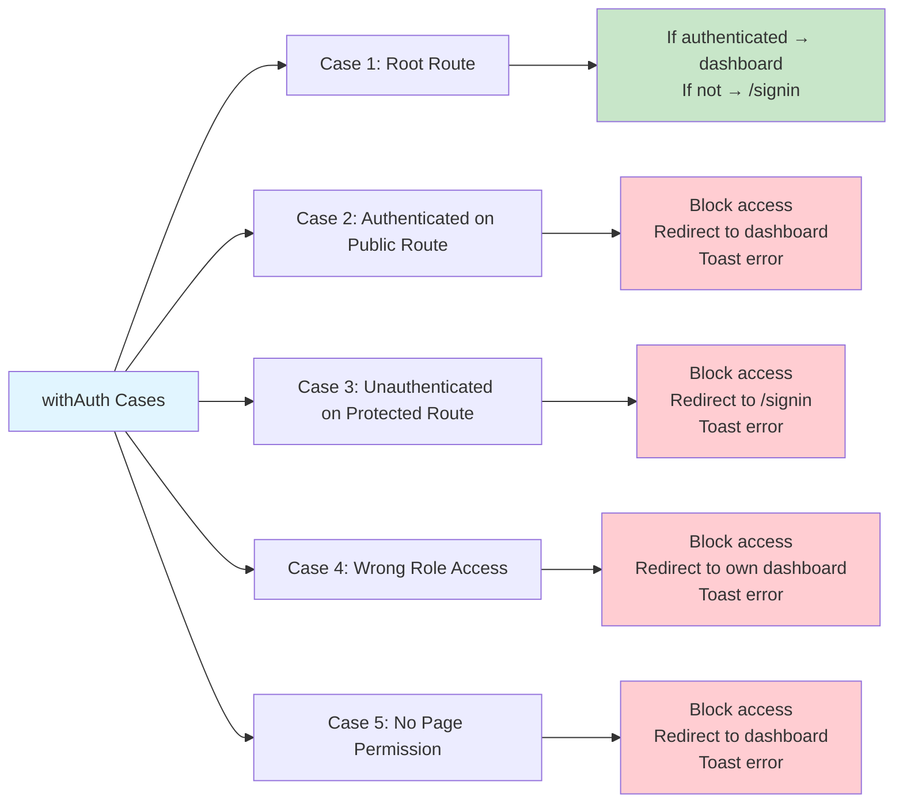

---

## Admin Dashboard Structure

### Component Hierarchy & Layout

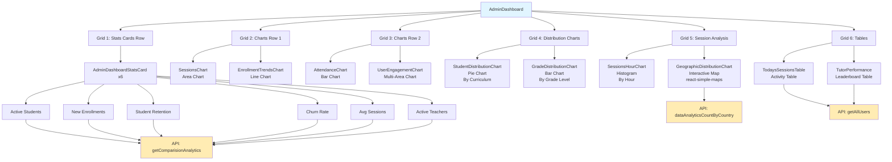

### Admin Dashboard Visual Layout

```
╔════════════════════════════════════════════════════════════════╗
║                       ADMIN DASHBOARD                          ║
╠════════════════════════════════════════════════════════════════╣
║  ┌──────────────┐  ┌──────────────┐  ┌──────────────┐        ║
║  │ 📊 Active    │  │ 📝 New       │  │ 🔄 Student   │        ║
║  │   Students   │  │   Enrollments│  │   Retention  │        ║
║  │   1,234 ↑5%  │  │   89 ↑12%    │  │   87% ↓2%    │        ║
║  └──────────────┘  └──────────────┘  └──────────────┘        ║
║  ┌──────────────┐  ┌──────────────┐  ┌──────────────┐        ║
║  │ 📉 Churn     │  │ 📅 Avg.      │  │ 👨‍🏫 Active   │        ║
║  │   Rate       │  │   Sessions   │  │   Teachers   │        ║
║  │   3.2% ↓1%   │  │   4.5 ↑8%    │  │   45 ↑3%     │        ║
║  └──────────────┘  └──────────────┘  └──────────────┘        ║
╠════════════════════════════════════════════════════════════════╣
║  ┌─────────────────────────────┐ ┌─────────────────────────┐  ║
║  │  📈 Sessions Booked         │ │ 📊 Enrollment Trends    │  ║
║  │  (Last 30 Days)             │ │ (New vs Churn)          │  ║
║  │                             │ │                         │  ║
║  │      /\    /\               │ │   ──── New              │  ║
║  │     /  \  /  \   /\         │ │   ---- Churn            │  ║
║  │    /    \/    \_/  \        │ │                         │  ║
║  └─────────────────────────────┘ └─────────────────────────┘  ║
╠════════════════════════════════════════════════════════════════╣
║  ┌─────────────────────────────┐ ┌─────────────────────────┐  ║
║  │  📊 Attendance by Subject   │ │ 📈 User Engagement      │  ║
║  │                             │ │                         │  ║
║  │  Math    ████████ 85%       │ │  Active Users ────      │  ║
║  │  Science ██████ 78%         │ │  Time Spent ····        │  ║
║  │  English █████████ 92%      │ │  New Users ----         │  ║
║  └─────────────────────────────┘ └─────────────────────────┘  ║
╠════════════════════════════════════════════════════════════════╣
║  ┌─────────────────────────────┐ ┌─────────────────────────┐  ║
║  │  🥧 Student Distribution    │ │ 📊 Grade Distribution   │  ║
║  │     (By Curriculum)         │ │                         │  ║
║  │                             │ │  Grade 10 ████████      │  ║
║  │      ╱─────╲                │ │  Grade 11 ██████        │  ║
║  │     │ IGCSE │ 40%           │ │  Grade 12 █████         │  ║
║  │     │ CBSE  │ 30%           │ │  Grade 9  ███████       │  ║
║  │      ╲─────╱                │ │  Grade 8  ████          │  ║
║  └─────────────────────────────┘ └─────────────────────────┘  ║
╠════════════════════════════════════════════════════════════════╣
║  ┌─────────────────────────────┐ ┌─────────────────────────┐  ║
║  │  🕐 Sessions by Hour        │ │ 🗺️  Geographic Map      │  ║
║  │                             │ │                         │  ║
║  │  9AM  ███                   │ │   ┌─────────────────┐   │  ║
║  │  3PM  ████████              │ │   │  🌍 World Map   │   │  ║
║  │  6PM  ████████████          │ │   │  📍 Markers     │   │  ║
║  └─────────────────────────────┘ └─────────────────────────┘  ║
╠════════════════════════════════════════════════════════════════╣
║  ┌─────────────────────────────┐ ┌─────────────────────────┐  ║
║  │  📅 Today's Sessions        │ │ 🏆 Top Tutor Performance│  ║
║  │                             │ │                         │  ║
║  │  10:00 | Math | John | ✅   │ │  1. Alice | 98 | ⭐4.9 │  ║
║  │  11:30 | Sci  | Jane | ⏳   │ │  2. Bob   | 87 | ⭐4.8 │  ║
║  │  14:00 | Eng  | Mike | 📅   │ │  3. Carol | 76 | ⭐4.7 │  ║
║  └─────────────────────────────┘ └─────────────────────────┘  ║
╚════════════════════════════════════════════════════════════════╝
```

---

## Student/Teacher Dashboard Structure

### Component Hierarchy & Layout

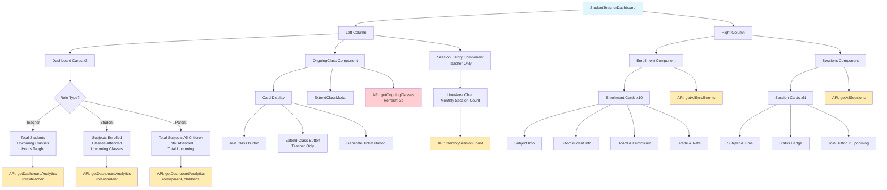

### Student/Teacher Dashboard Visual Layout

```
╔═══════════════════════════════════════════════════════════════╗
║              STUDENT / TEACHER / PARENT DASHBOARD             ║
╠═══════════════════════════════════════════════════════════════╣
║  ┌───────────────────┐  ┌────────────────────────────────┐   ║
║  │  LEFT COLUMN      │  │  RIGHT COLUMN                  │   ║
║  │                   │  │                                │   ║
║  │ ┌───────────────┐ │  │ ┌────────────────────────────┐ │   ║
║  │ │ 📊 Card 1     │ │  │ │ 📚 ENROLLMENT              │ │   ║
║  │ │ Total Students│ │  │ │                            │ │   ║
║  │ │     156       │ │  │ │ ┌────────────────────────┐ │ │   ║
║  │ └───────────────┘ │  │ │ │ Math - Grade 10        │ │ │   ║
║  │                   │  │ │ │ Teacher: John Doe      │ │ │   ║
║  │ ┌───────────────┐ │  │ │ │ IGCSE | Cambridge      │ │ │   ║
║  │ │ 📅 Card 2     │ │  │ │ │ $25/hr                 │ │ │   ║
║  │ │ Upcoming      │ │  │ │ └────────────────────────┘ │ │   ║
║  │ │ Classes: 8    │ │  │ │                            │ │   ║
║  │ └───────────────┘ │  │ │ ┌────────────────────────┐ │ │   ║
║  │                   │  │ │ │ Science - Grade 10     │ │ │   ║
║  │ ┌───────────────┐ │  │ │ │ Teacher: Jane Smith    │ │ │   ║
║  │ │ ⏱️ Card 3     │ │  │ │ │ CBSE | NCERT           │ │ │   ║
║  │ │ Hours Taught  │ │  │ │ │ $30/hr                 │ │ │   ║
║  │ │     124.5     │ │  │ │ └────────────────────────┘ │ │   ║
║  │ └───────────────┘ │  │ │                            │ │   ║
║  │                   │  │ │ ... (8 more enrollments)  │ │   ║
║  │ ┌───────────────┐ │  │ └────────────────────────────┘ │   ║
║  │ │ 🔴 ONGOING    │ │  │                                │   ║
║  │ │   CLASSES     │ │  │ ┌────────────────────────────┐ │   ║
║  │ │   (Live)      │ │  │ │ 📅 SESSIONS                │ │   ║
║  │ │               │ │  │ │                            │ │   ║
║  │ │ Mathematics   │ │  │ │ ┌────────────────────────┐ │ │   ║
║  │ │ 10:00-11:00   │ │  │ │ │ Math | Mon 3:00 PM     │ │ │   ║
║  │ │ [Join] [+15]  │ │  │ │ │ Status: Scheduled      │ │ │   ║
║  │ │ [Ticket]      │ │  │ │ │ [Join Class]           │ │ │   ║
║  │ │               │ │  │ │ └────────────────────────┘ │ │   ║
║  │ │ Refresh: 3s ⟳ │ │  │ │                            │ │   ║
║  │ └───────────────┘ │  │ │ ┌────────────────────────┐ │ │   ║
║  │                   │  │ │ │ Science | Tue 4:00 PM  │ │ │   ║
║  │ ┌───────────────┐ │  │ │ │ Status: Completed ✅   │ │ │   ║
║  │ │ 📊 SESSION    │ │  │ │ └────────────────────────┘ │ │   ║
║  │ │   HISTORY     │ │  │ │                            │ │   ║
║  │ │   (Teacher)   │ │  │ │ ... (more sessions)        │ │   ║
║  │ │               │ │  │ └────────────────────────────┘ │   ║
║  │ │     /\  /\    │ │  │                                │   ║
║  │ │    /  \/  \   │ │  │                                │   ║
║  │ │  Jan Feb Mar  │ │  │                                │   ║
║  │ └───────────────┘ │  │                                │   ║
║  └───────────────────┘  └────────────────────────────────┘   ║
╚═══════════════════════════════════════════════════════════════╝
```

---

## API Call Sequence Diagrams

### Sign-In & Initial Data Load

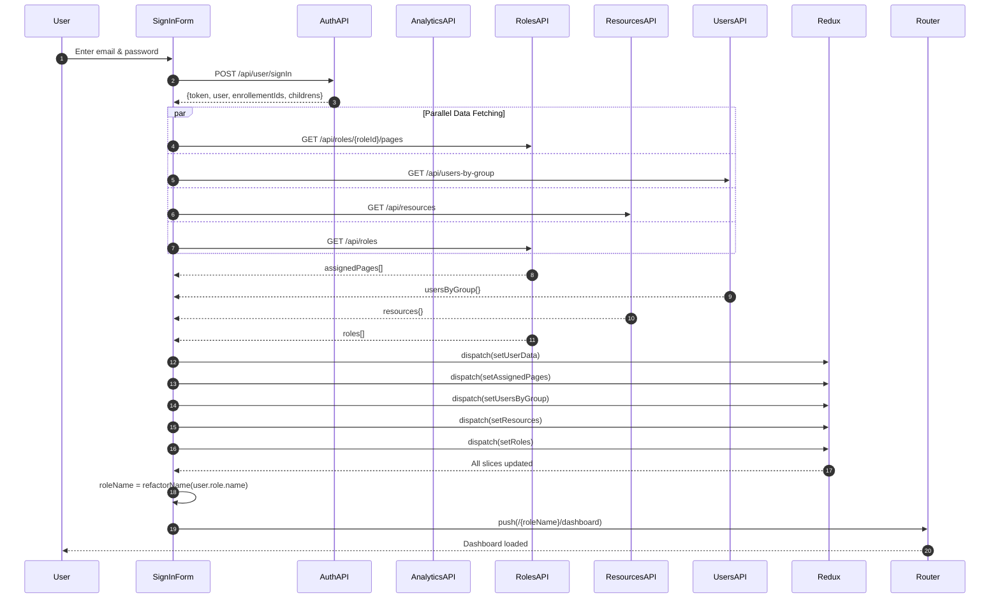

---

### Admin Dashboard Data Load

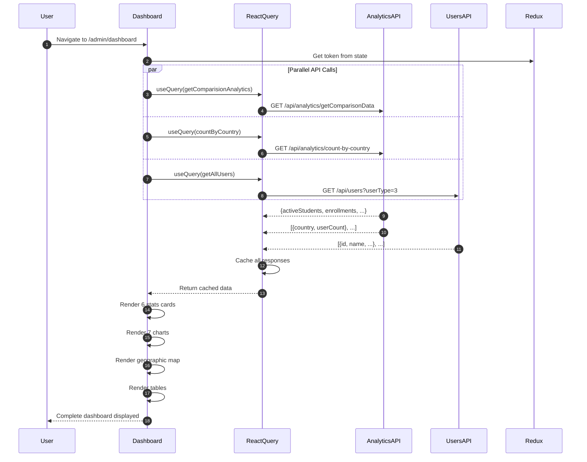

---

### Student/Teacher Dashboard Data Load

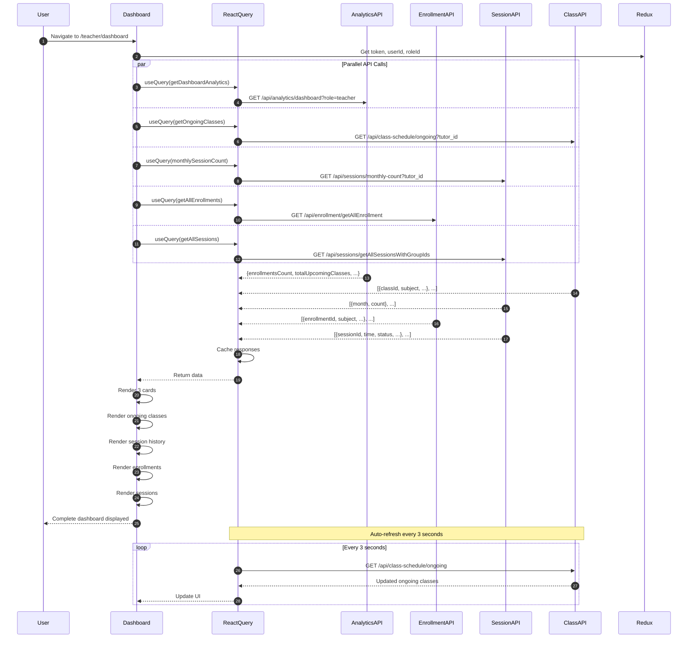

---

### Extend Class Action Flow

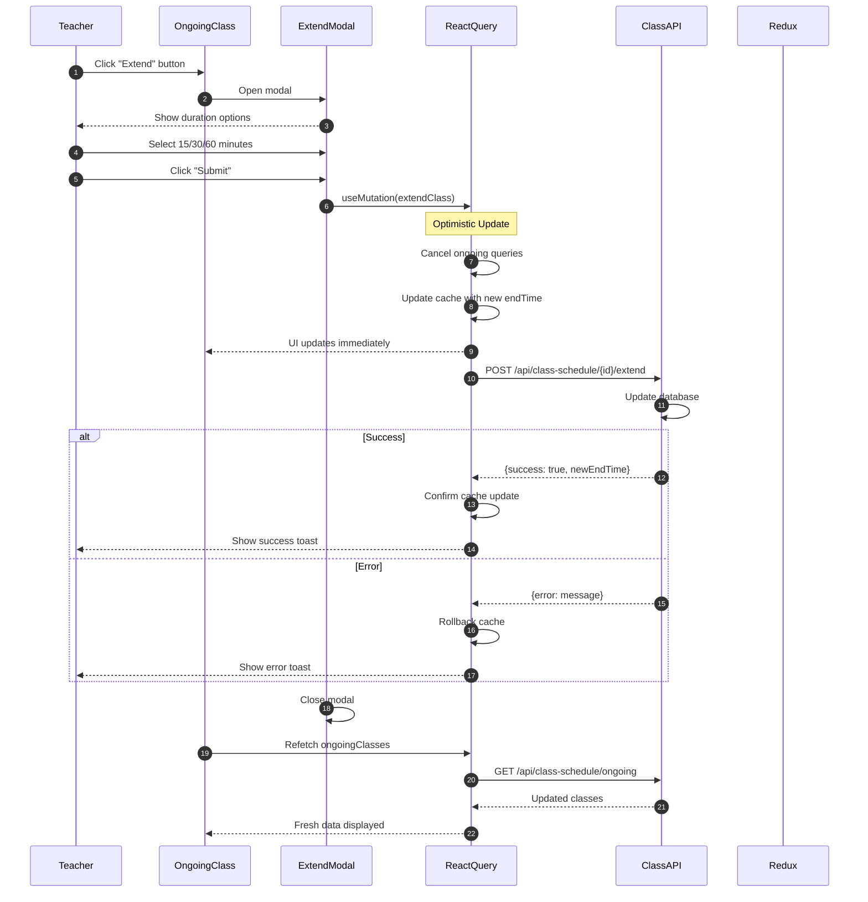

---

## State Management Flow

### Redux Store Architecture

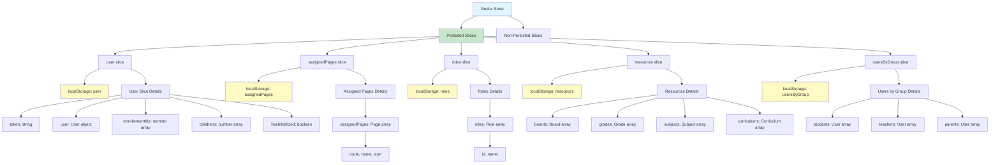

### Data Persistence Flow

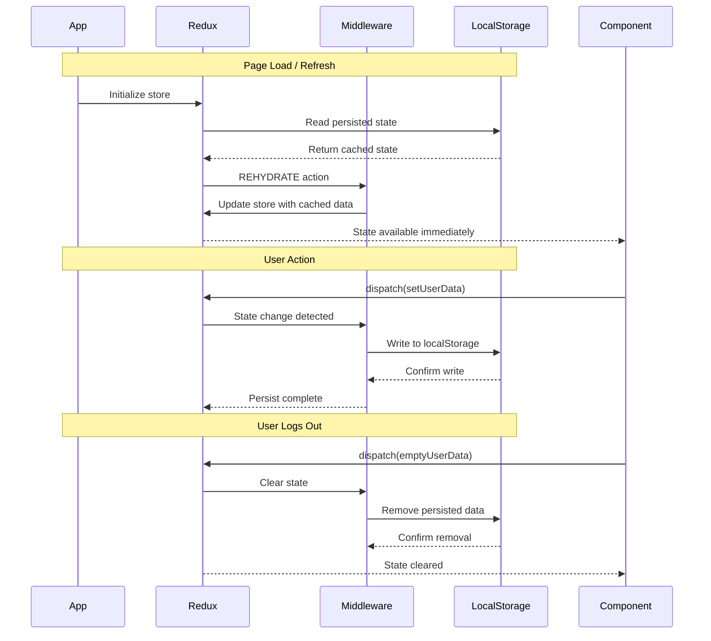

---

## Real-Time Update Flow

### Ongoing Classes Auto-Refresh

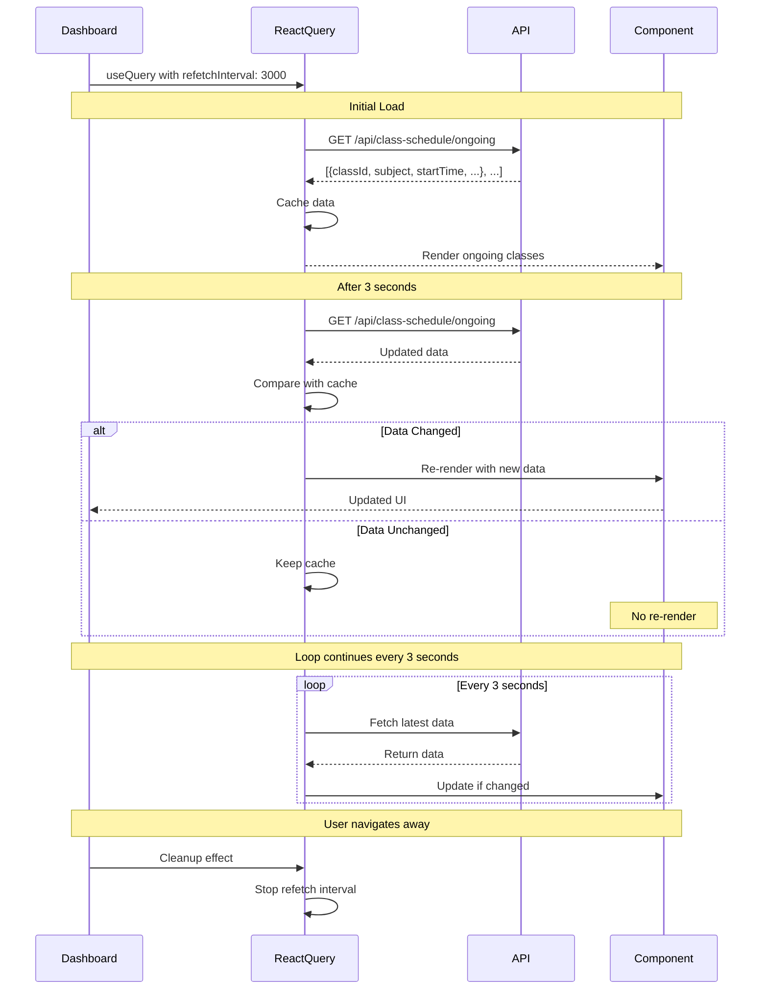

### Protected Layout Data Refresh

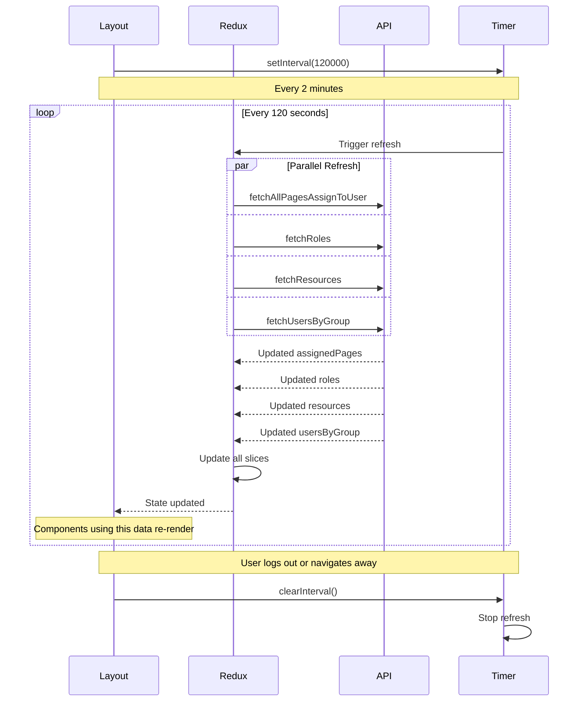

---

## Complete Navigation Mind Map

### Entire Application Flow

```
Tuitional LMS Frontend
│
├── Authentication System
│   ├── Public Routes
│   │   ├── /signin
│   │   │   ├── Email & Password form
│   │   │   ├── Validation (React Hook Form)
│   │   │   ├── API: POST /api/user/signIn
│   │   │   └── On Success → Parallel Data Fetching
│   │   ├── /forgot-password
│   │   ├── /password-reset/[email]
│   │   └── /confirm-password/[email]
│   │
│   └── Authentication Response
│       ├── Token (JWT)
│       ├── User Object (id, roleId, name, role.name)
│       ├── enrollementIds (for students)
│       └── childrens (for parents)
│
├── Post-Authentication Data Fetching
│   ├── fetchAllPagesAssignToUser → assignedPages slice
│   ├── fetchUsersByGroup → usersByGroup slice
│   ├── fetchResources → resources slice
│   └── fetchRoles → roles slice
│
├── Role Transformation & Redirect
│   ├── Extract role.name from response
│   ├── Transform to camelCase
│   │   ├── "Super Admin" → "superAdmin"
│   │   ├── "School Admin" → "schoolAdmin"
│   │   ├── "Student" → "student"
│   │   ├── "Teacher" → "teacher"
│   │   ├── "Parent" → "parent"
│   │   ├── "Counsellor" → "counsellor"
│   │   └── "HR" → "hr"
│   └── Navigate to /{roleName}/dashboard
│
├── Protected Routes System (withAuth HOC)
│   ├── Route Protection Cases
│   │   ├── Case 1: Root "/" → Redirect based on auth
│   │   ├── Case 2: Authenticated on public route → Block
│   │   ├── Case 3: Unauthenticated on protected → Block
│   │   ├── Case 4: Wrong role access → Block
│   │   └── Case 5: No page permission → Block
│   │
│   ├── Verification Steps
│   │   ├── Check token exists
│   │   ├── Check user.roleId exists
│   │   ├── Check role matches URL
│   │   └── Check page in assignedPages
│   │
│   └── Redirect Logic
│       ├── Unauthenticated → /signin
│       ├── Authenticated on public → /{role}/dashboard
│       └── No permission → /{role}/dashboard
│
├── Dashboard Routing
│   ├── Route: /{role}/dashboard
│   ├── Dashboard Selection
│   │   ├── IF role = student/teacher/parent
│   │   │   └── Load: StudentTeacherDashboard
│   │   └── ELSE (superAdmin/admin/counsellor/hr)
│   │       └── Load: AdminDashboard
│   │
│   ├── Admin Dashboard
│   │   ├── Users: superAdmin, admin, counsellor, hr
│   │   ├── Layout: 6 grids, 11 components
│   │   ├── Components
│   │   │   ├── Grid 1: 6 Stats Cards
│   │   │   │   ├── Active Students (↑/↓ %)
│   │   │   │   ├── New Enrollments (↑/↓ %)
│   │   │   │   ├── Student Retention (↑/↓ %)
│   │   │   │   ├── Churn Rate (↑/↓ %)
│   │   │   │   ├── Avg Sessions (↑/↓ %)
│   │   │   │   └── Active Teachers (↑/↓ %)
│   │   │   ├── Grid 2: Charts Row 1
│   │   │   │   ├── Sessions Chart (Area)
│   │   │   │   └── Enrollment Trends (Line)
│   │   │   ├── Grid 3: Charts Row 2
│   │   │   │   ├── Attendance Chart (Bar)
│   │   │   │   └── User Engagement (Multi-Area)
│   │   │   ├── Grid 4: Distribution Charts
│   │   │   │   ├── Student Distribution (Pie)
│   │   │   │   └── Grade Distribution (Bar)
│   │   │   ├── Grid 5: Session Analysis
│   │   │   │   ├── Sessions by Hour (Histogram)
│   │   │   │   └── Geographic Map (react-simple-maps)
│   │   │   └── Grid 6: Tables
│   │   │       ├── Today's Sessions Table
│   │   │       └── Tutor Performance Table
│   │   ├── API Calls
│   │   │   ├── getComparisionAnalytics
│   │   │   ├── dataAnalyticsCountByCountry
│   │   │   └── getAllUsers
│   │   └── User Actions
│   │       ├── Monitor metrics & trends
│   │       ├── Analyze geographic distribution
│   │       ├── Review tutor performance
│   │       └── Track today's session activity
│   │
│   └── Student/Teacher Dashboard
│       ├── Users: student, teacher, parent
│       ├── Layout: 2-column
│       ├── Left Column Components
│       │   ├── Dashboard Cards (x3)
│       │   │   ├── Teacher View
│       │   │   │   ├── Total Students
│       │   │   │   ├── Upcoming Scheduled Classes
│       │   │   │   └── Total Hours Taught
│       │   │   ├── Student View
│       │   │   │   ├── Subjects Enrolled
│       │   │   │   ├── Classes Attended
│       │   │   │   └── Upcoming Classes
│       │   │   └── Parent View
│       │   │       ├── Total Subjects (all children)
│       │   │       ├── Classes Attended (all children)
│       │   │       └── Upcoming Classes (all children)
│       │   ├── OngoingClass Component
│       │   │   ├── Real-time updates (3s refresh)
│       │   │   ├── Join Class button
│       │   │   ├── Extend Class button (teacher)
│       │   │   ├── Generate Ticket button
│       │   │   └── ExtendClassModal
│       │   └── SessionHistory Component (Teacher only)
│       │       └── Monthly session count chart
│       ├── Right Column Components
│       │   ├── Enrollment Component
│       │   │   ├── Last 10 enrollments
│       │   │   ├── Subject, tutor, board, curriculum
│       │   │   ├── Grade level & hourly rate
│       │   │   └── Role-based filtering
│       │   └── Sessions Component
│       │       ├── Upcoming & past sessions
│       │       ├── Date, time, status
│       │       ├── Join button for upcoming
│       │       └── Color-coded status badges
│       ├── API Calls
│       │   ├── getDashboardAnalytics (role-based)
│       │   ├── getOngoingClasses (3s refresh)
│       │   ├── monthlySessionCount (role-based)
│       │   ├── getAllEnrollments (role-based)
│       │   └── getAllSessions (role-based)
│       └── User Actions
│           ├── View role-specific metrics
│           ├── Join ongoing classes
│           ├── Extend class duration (teacher)
│           ├── Generate support tickets
│           ├── View enrollments & courses
│           └── Manage session schedules
│
├── State Management
│   ├── Redux Store
│   │   ├── Persisted Slices (localStorage)
│   │   │   ├── user slice (token, user, enrollementIds, childrens)
│   │   │   ├── assignedPages slice (accessible routes)
│   │   │   ├── roles slice (all system roles)
│   │   │   ├── resources slice (boards, grades, subjects, curriculums)
│   │   │   └── usersByGroup slice (students, teachers, parents)
│   │   └── Actions
│   │       ├── setUserData (after login)
│   │       ├── emptyUserData (on logout)
│   │       ├── fetchAllPagesAssignToUser
│   │       ├── fetchUsersByGroup
│   │       ├── fetchResources
│   │       └── fetchRoles
│   └── TanStack Query (Server State)
│       ├── Query Configuration
│       │   ├── queryKey (unique identifier)
│       │   ├── queryFn (API call)
│       │   ├── enabled (conditional fetching)
│       │   ├── staleTime (5 minutes default)
│       │   └── refetchInterval (for real-time data)
│       ├── Query Caching (5 minutes)
│       └── Mutations (actions)
│           ├── extendClass
│           ├── joinClassTracking
│           └── generateTicket
│
├── Real-Time Features
│   ├── Ongoing Classes Auto-Refresh
│   │   ├── Interval: 3 seconds
│   │   ├── API: GET /api/class-schedule/ongoing
│   │   └── Updates: Immediate UI refresh on data change
│   └── Protected Layout Auto-Refresh
│       ├── Interval: 2 minutes (120 seconds)
│       ├── Refreshes: assignedPages, roles, resources, usersByGroup
│       └── Purpose: Keep permissions up-to-date
│
├── Performance Optimizations
│   ├── Memoization (React.memo, useMemo, useCallback)
│   ├── Code Splitting (dynamic imports)
│   ├── Query Caching (TanStack Query)
│   ├── Optimistic Updates (mutations)
│   ├── CSS Modules (scoped styling)
│   └── Responsive Design (clamp(), grid auto-fit)
│
└── Security Features
    ├── JWT Token Authentication
    ├── Role-Based Access Control (RBAC)
    ├── Permission-Based Routing
    ├── Route Matching & Verification
    ├── Automatic Redirects
    ├── Token in All API Requests
    └── Logout Cleanup (clear Redux & localStorage)
```

---

## Conclusion

This visual documentation provides:

- ✅ **Complete flowcharts** for authentication and routing
- ✅ **Mermaid diagrams** for role-based navigation
- ✅ **Sequence diagrams** for API interactions
- ✅ **ASCII art layouts** for dashboard structures
- ✅ **Mind maps** for application architecture
- ✅ **State management flows** for Redux and React Query
- ✅ **Real-time update visualizations**

All diagrams are designed to be:
- **Clear and readable** for developers
- **Technically accurate** based on actual implementation
- **Comprehensive** covering all major flows
- **Professional** suitable for technical documentation

Use these diagrams as reference for:
- Onboarding new developers
- Understanding system architecture
- Debugging authentication issues
- Planning new features
- Technical presentations
- Code reviews
