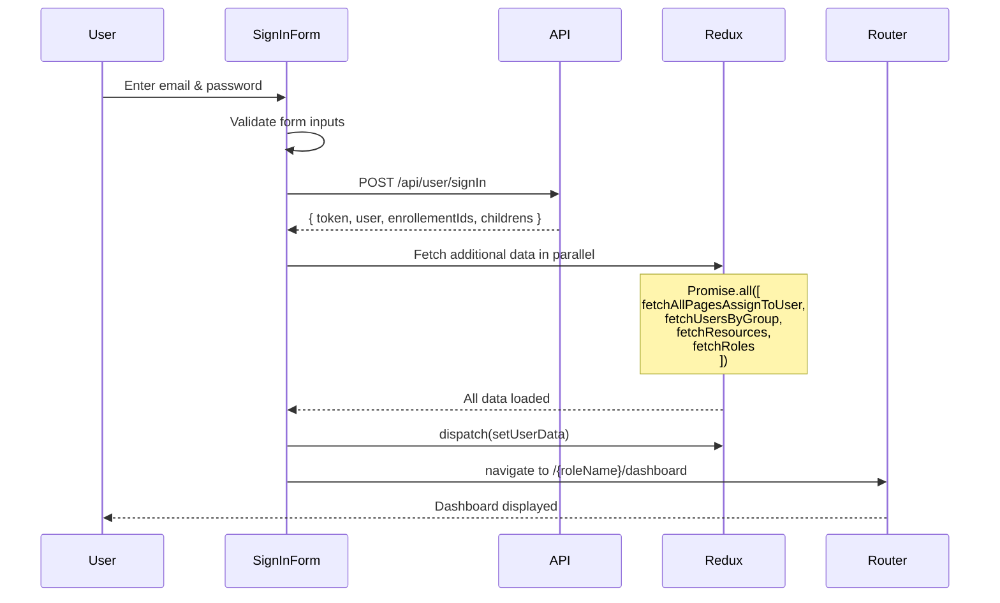

# Post-Authentication Flow

Complete documentation of the post-authentication routing system in the Tuitional LMS Frontend.

---

## Table of Contents

1. [Overview](#overview)
2. [Authentication Entry Point](#authentication-entry-point)
3. [Post-Authentication Routing Logic](#post-authentication-routing-logic)
4. [Role Name Transformation](#role-name-transformation)
5. [Protected Route System](#protected-route-system)
6. [Navigation Flow Timeline](#navigation-flow-timeline)
7. [Key Files Reference](#key-files-reference)

---

## Overview

When a user successfully authenticates in the Tuitional LMS, the application follows a sophisticated routing system that:

1. **Validates credentials** via API
2. **Fetches user permissions** and role data
3. **Stores authentication state** in Redux (persisted to localStorage)
4. **Redirects to role-specific dashboard** based on user's role
5. **Protects routes** using the `withAuth` HOC (Higher-Order Component)

---

## Authentication Entry Point

### File Location
```
src/app/(public)/signin/page.tsx
```

### Sign-In Process Flow



### Step-by-Step Breakdown

#### Step 1: User Submits Credentials
```typescript
// User inputs validated by React Hook Form
{
  email: string,    // Must match emailRegex
  password: string  // Minimum 6 characters
}
```

**File:** `src/app/(public)/signin/page.tsx:132-139`

---

#### Step 2: API Authentication
```typescript
SignIn({ email, password }, {})
  → POST /api/user/signIn
  → Returns: SignIn_Response_Type
```

**Response Structure:**
```typescript
{
  token: string,              // JWT authentication token
  user: {
    id: number,
    roleId: number,           // 1=superAdmin, 2=admin, 3=student, 4=parent, 5=teacher
    name: string,
    email: string,
    role: {
      id: number,
      name: string            // "Super Admin", "Student", "Teacher", etc.
    },
    isSync: boolean,          // Google calendar sync status
    profileImageUrl: string,
    // ... other user fields
  },
  enrollementIds?: number[],  // Student enrollments
  childrens?: number[]        // Parent's children IDs
}
```

**File:** `src/app/(public)/signin/page.tsx:78-79`

---

#### Step 3: Parallel Data Fetching
After successful authentication, the app fetches additional required data in parallel:

```typescript
await Promise.all([
  dispatch(fetchAllPagesAssignToUser(data?.user?.roleId, { token: data?.token })),
  dispatch(fetchUsersByGroup({ token: data?.token })),
  dispatch(fetchResources({ token: data?.token })),
  dispatch(fetchRoles({ token: data?.token })),
]);
```

**What Each Fetch Does:**

| Action | Endpoint | Purpose |
|--------|----------|---------|
| `fetchAllPagesAssignToUser` | `/api/roles/{roleId}/pages` | Gets list of accessible pages for user's role |
| `fetchUsersByGroup` | `/api/users-by-group` | Fetches students, teachers, parents lists |
| `fetchResources` | `/api/resources` | Loads boards, grades, subjects, curriculums |
| `fetchRoles` | `/api/roles` | Gets all system roles with IDs and names |

**File:** `src/app/(public)/signin/page.tsx:82-91`

---

#### Step 4: Redux State Update
```typescript
const updatedUser = {
  token: data?.token,
  enrollementIds: data?.enrollementIds ? [...data?.enrollementIds] : [],
  childrens: data?.childrens ? [...data?.childrens] : [],
  user: { ...data?.user, firebase_token: "" }
};

dispatch(setUserData(updatedUser));
```

**Redux Slices Updated:**
- ✅ `user` slice - Stores token and user object
- ✅ `assignedPages` slice - Stores accessible routes
- ✅ `usersByGroup` slice - Stores user lists
- ✅ `resources` slice - Stores educational resources
- ✅ `roles` slice - Stores all system roles

**All slices are persisted to localStorage** via `redux-persist`.

**File:** `src/app/(public)/signin/page.tsx:93-101`

---

#### Step 5: Role-Based Redirect
```typescript
const roleName = refactorName(data?.user?.role?.name);
router.push(`/${roleName}/dashboard`);
```

**Transformation Example:**
- API returns: `"Super Admin"`
- Frontend URL: `/superAdmin/dashboard`

**File:** `src/app/(public)/signin/page.tsx:103-104`

---

## Post-Authentication Routing Logic

### First Route Loaded After Login

**Answer:** `/{roleName}/dashboard`

Where `{roleName}` is the camelCase transformation of the user's role name from the API.

### Redirect Decision Logic

The redirect is determined by:

1. **User's `roleId`** from the authentication response
2. **Role name lookup** from the `roles` slice
3. **Name transformation** using `refactorName()` function
4. **Route construction** as `/{roleName}/dashboard`

---

## Role Name Transformation

### Function: `refactorName()`

Converts role names from backend format to URL-safe camelCase format.

```typescript
const refactorName = (name: string) => {
  if (!name) return undefined;
  const words = name.split(" ");
  if (words.length === 1) {
    return name.toLowerCase();
  }
  return words
    .map((word, index) =>
      index === 0
        ? word.toLowerCase()
        : word.charAt(0).toUpperCase() + word.slice(1).toLowerCase()
    )
    .join("");
};
```

### Transformation Examples

| Backend Role Name | Frontend URL Route |
|-------------------|-------------------|
| "Super Admin" | `/superAdmin/dashboard` |
| "School Admin" | `/schoolAdmin/dashboard` |
| "Student" | `/student/dashboard` |
| "Teacher" | `/teacher/dashboard` |
| "Parent" | `/parent/dashboard` |
| "Counsellor" | `/counsellor/dashboard` |
| "HR" | `/hr/dashboard` |

**Files:**
- `src/app/(public)/signin/page.tsx:45-58`
- `src/utils/withAuth/withAuth.jsx:80-94`

---

## Protected Route System

### withAuth HOC

All protected pages are wrapped with the `withAuth` Higher-Order Component which handles:
- Authentication verification
- Role-based access control
- Permission-based route access
- Automatic redirects

**File:** `src/utils/withAuth/withAuth.jsx`

---

### Route Protection Rules

#### Public Routes (No Authentication Required)
```typescript
const PUBLIC_ROUTES = [
  "/signin",
  "/forgot-password",
  /^\/password-reset(\/.*)?$/,
  /^\/confirm-password(\/.*)?$/,
];
```

**File:** `src/utils/withAuth/withAuth.jsx:9-14`

---

#### Protected Routes Structure

```
src/app/(protected)/[role]/
├── dashboard/
├── students/
├── teachers/
├── enrollments/
├── schedule/
├── chat/
├── profile/
├── settings/
└── ... (other role-specific pages)
```

Each route is dynamically generated based on the `[role]` parameter.

---

### Authentication Verification Flow

```mermaid
flowchart TD
    A[User navigates to route] --> B{Is route /}
    B -->|Yes| C{User authenticated?}
    C -->|Yes| D[Redirect to /{roleName}/dashboard]
    C -->|No| E[Redirect to /signin]

    B -->|No| F{Is route public?}
    F -->|Yes| G{User authenticated?}
    G -->|Yes| H[Block: redirect to dashboard]
    G -->|No| I[Allow access]

    F -->|No| J{User authenticated?}
    J -->|No| K[Block: redirect to /signin]
    J -->|Yes| L{Role matches route?}
    L -->|No| M[Block: redirect to own dashboard]
    L -->|Yes| N{Has page permission?}
    N -->|No| O[Block: redirect to own dashboard]
    N -->|Yes| P[Allow access: Render page]
```

---

### withAuth Logic Cases

#### Case 1: Root Route "/"
```typescript
if (pathname === "/") {
  if (isAuthenticated) {
    navigateTo(roleBasePath);  // /{roleName}/dashboard
  } else {
    navigateTo("/signin");
  }
}
```

**File:** `src/utils/withAuth/withAuth.jsx:152-159`

---

#### Case 2: Authenticated User on Public Route
```typescript
if (isAuthenticated && isPublicRoute) {
  navigateTo(roleBasePath, {
    type: "error",
    text: "You are already logged in. Redirecting to your dashboard."
  });
}
```

**Example:** A logged-in user trying to access `/signin` will be redirected to their dashboard.

**File:** `src/utils/withAuth/withAuth.jsx:166-172`

---

#### Case 3: Unauthenticated User on Protected Route
```typescript
if (!isAuthenticated && !isPublicRoute) {
  navigateTo("/signin", {
    type: "error",
    text: "Access denied. Please sign in."
  });
}
```

**File:** `src/utils/withAuth/withAuth.jsx:204-211`

---

#### Case 4: User Accessing Different Role's Route
```typescript
if (roleFromPath !== roleName && !isPublicRoute) {
  navigateTo(roleBasePath, {
    type: "error",
    text: "Unauthorized access. Redirecting to your dashboard."
  });
}
```

**Example:** A teacher trying to access `/admin/dashboard` will be redirected to `/teacher/dashboard`.

**File:** `src/utils/withAuth/withAuth.jsx:175-186`

---

#### Case 5: User Lacking Page Permission
```typescript
if (!isProtectedRoute && assignedPages.length > 0) {
  navigateTo(roleBasePath, {
    type: "error",
    text: "You don't have access to this page. Redirecting to your dashboard."
  });
}
```

**File:** `src/utils/withAuth/withAuth.jsx:188-200`

---

### Access Control Check

```typescript
const isAllowedAccess = useMemo(() => {
  if (isPublicRoute) return true;           // Allow public routes
  if (!isAuthenticated) return false;        // Block unauthenticated
  if (!assignedPages || assignedPages.length === 0) return true; // Loading
  return isProtectedRoute;                   // Check permissions
}, [isPublicRoute, isAuthenticated, assignedPages, isProtectedRoute]);

return isAllowedAccess ? <WrappedComponent {...props} /> : null;
```

**File:** `src/utils/withAuth/withAuth.jsx:231-245`

---

## Navigation Flow Timeline

### Complete User Journey from Login to Dashboard

```
T0: User visits root "/"
    └─ withAuth HOC intercepts
       └─ Checks Redux state (rehydrated from localStorage)
          ├─ No token → Redirect to /signin
          └─ Token exists → Redirect to /{roleName}/dashboard

T1: User submits credentials on /signin
    └─ Form validation (email regex, password min length)
    └─ API POST /api/user/signIn
    └─ Response received: { token, user, enrollementIds, childrens }

T2: Parallel data fetching initiated
    ├─ fetchAllPagesAssignToUser (role permissions)
    ├─ fetchUsersByGroup (users data)
    ├─ fetchResources (educational resources)
    └─ fetchRoles (all system roles)

T3: Redux state updated
    └─ dispatch(setUserData)
       ├─ User slice updated
       ├─ Assigned pages slice updated
       ├─ Users by group slice updated
       ├─ Resources slice updated
       └─ Roles slice updated
    └─ All data persisted to localStorage

T4: Role-based navigation
    └─ Extract role name: "Super Admin"
    └─ Transform to camelCase: "superAdmin"
    └─ router.push("/superAdmin/dashboard")

T5: Route access verification
    └─ withAuth verifies:
       ├─ ✓ Token exists
       ├─ ✓ user.roleId exists
       ├─ ✓ roleId matches route
       └─ ✓ /dashboard in assignedPages
    └─ ProtectedLayout renders
    └─ Dashboard component loads

T6: Automatic data refresh (every 2 minutes)
    └─ ProtectedLayout useEffect
       └─ Re-fetch assignedPages, roles, resources, usersByGroup

T7: User refreshes page (F5)
    └─ Redux PersistGate rehydrates state from localStorage
    └─ withAuth validates access immediately
    └─ User stays on current page (no redirect needed)
```

---

## Key Files Reference

### Authentication Files

| File | Purpose | Key Functions |
|------|---------|---------------|
| `src/app/(public)/signin/page.tsx` | Sign-in form and post-auth logic | `refactorName()`, mutation handling |
| `src/services/auth/auth.ts` | Authentication API calls | `SignIn()`, `ForgotPassword()` |
| `src/services/auth/auth.types.ts` | Auth type definitions | `SignIn_Payload_Type`, `SignIn_Response_Type` |

---

### Routing & Protection Files

| File | Purpose | Key Logic |
|------|---------|-----------|
| `src/utils/withAuth/withAuth.jsx` | Protected route HOC | Authentication & authorization |
| `src/app/(protected)/layout.tsx` | Protected routes layout | Sidebar, header, auto-refresh |
| `src/app/(protected)/[role]/dashboard/page.tsx` | Dashboard router | Role-based dashboard selection |

---

### Redux State Management Files

| File | Purpose | Data Stored |
|------|---------|-------------|
| `src/lib/store/slices/user-slice.ts` | User authentication state | token, user, enrollementIds, childrens |
| `src/lib/store/slices/assignedPages-slice.ts` | User's accessible pages | Array of page routes |
| `src/lib/store/slices/role-slice.ts` | System roles | All roles with IDs and names |
| `src/lib/store/slices/usersByGroup-slice.ts` | User lists | Students, teachers, parents |
| `src/lib/store/slices/resources-slice.ts` | Educational resources | Boards, grades, subjects, curriculums |
| `src/lib/store/store.ts` | Redux store configuration | Persistence setup |

---

### Provider & Setup Files

| File | Purpose | Wraps |
|------|---------|-------|
| `src/app/provider.tsx` | Global providers | Redux, TanStack Query, Toast |
| `src/app/layout.tsx` | Root layout | Providers, fonts, metadata |

---

## Security Features

1. **JWT Token Storage**
   - Stored in Redux user slice
   - Persisted to localStorage via redux-persist
   - Included in all API requests via config

2. **Role-Based Access Control (RBAC)**
   - Verified by withAuth HOC on every route
   - Checks user's roleId against route's role parameter

3. **Permission-Based Routing**
   - assignedPages slice controls accessible routes
   - Verified on every navigation attempt

4. **Automatic Redirect**
   - Unauthenticated users → /signin
   - Authenticated users on public routes → dashboard
   - Users accessing unauthorized routes → own dashboard

5. **Route Matching with Memoization**
   - Optimized route checking with caching
   - Supports string patterns and regex patterns
   - Max 100 cache entries to prevent memory bloat

6. **Logout Cleanup**
   - `emptyUserData()` action clears all Redux state
   - localStorage cleared
   - Automatic redirect to /signin

---

## Conclusion

The post-authentication flow in Tuitional LMS ensures secure, role-based navigation with:
- ✅ Robust authentication and authorization
- ✅ Persistent session management
- ✅ Dynamic role-based routing
- ✅ Permission-based page access
- ✅ Optimized performance with memoization
- ✅ Automatic data refresh every 2 minutes

All components work together to provide a seamless, secure user experience from login to dashboard interaction.
