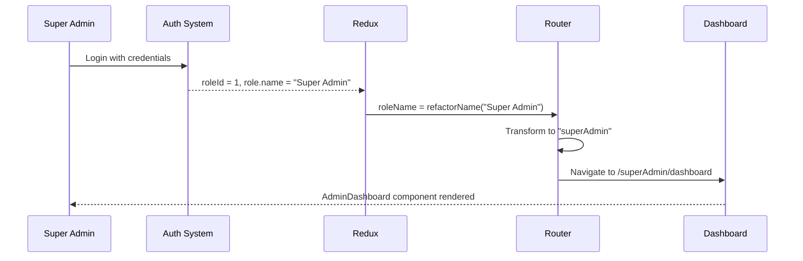
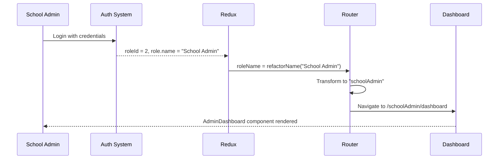
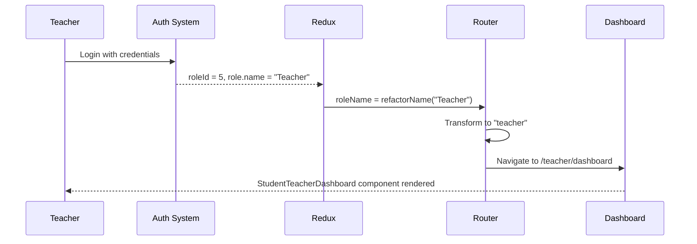
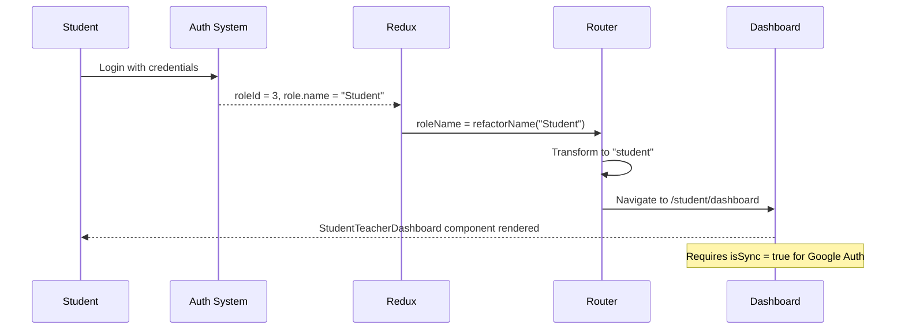
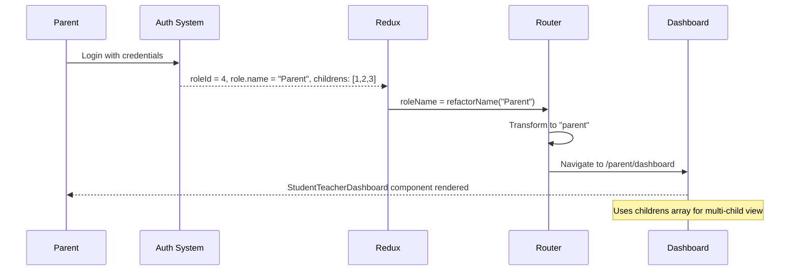
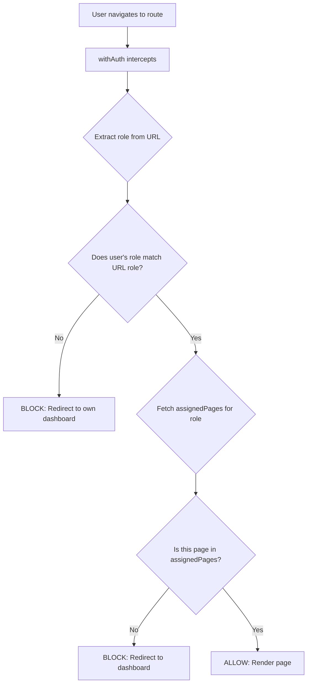

# Role-Based Routing & User Roles

Complete documentation of user roles, their post-authentication behavior, permissions, and routing logic in the Tuitional LMS Frontend.

---

## Table of Contents

1. [Overview](#overview)
2. [User Role Definitions](#user-role-definitions)
3. [Role-Specific Post-Authentication Behavior](#role-specific-post-authentication-behavior)
4. [Dashboard Selection Logic](#dashboard-selection-logic)
5. [Role-Based Route Structure](#role-based-route-structure)
6. [Role Permissions & Restrictions](#role-permissions--restrictions)
7. [Role Transformation Reference](#role-transformation-reference)

---

## Overview

The Tuitional LMS supports **7 primary user roles**, each with distinct permissions, dashboard views, and accessible routes. The role-based routing system dynamically adapts the application based on the authenticated user's role.

### Role Hierarchy

```
┌─────────────────────────────────────────────┐
│           Super Admin (roleId: 1)           │
│         System-wide administrative          │
└─────────────────────────────────────────────┘
                     ↓
┌─────────────────────────────────────────────┐
│         School Admin (roleId: 2)            │
│      Institution-level management           │
└─────────────────────────────────────────────┘
                     ↓
        ┌────────────┴────────────┐
        ↓                         ↓
┌─────────────────┐       ┌─────────────────┐
│  Counsellor     │       │       HR        │
│   (roleId: 6)   │       │   (roleId: 7)   │
└─────────────────┘       └─────────────────┘
                     ↓
        ┌────────────┴────────────┐
        ↓                         ↓
┌─────────────────┐       ┌─────────────────┐
│  Teacher/Tutor  │       │     Student     │
│   (roleId: 5)   │       │   (roleId: 3)   │
└─────────────────┘       └─────────────────┘
                     ↓
                ┌────────┐
                │ Parent │
                │(roleId:4)
                └────────┘
```

---

## User Role Definitions

### 1. Super Admin (`roleId: 1`)

**Backend Name:** `"Super Admin"`
**URL Route:** `/superAdmin/*`
**Access Level:** System-wide administrative access

**Description:**
The highest privilege level in the system. Has access to all features, analytics, and administrative functions across all schools and institutions.

**Key Responsibilities:**
- Platform-wide analytics and monitoring
- User role management
- System configuration
- Global resource management
- School/institution oversight
- Performance monitoring
- Geographic distribution analysis

---

### 2. School Admin (`roleId: 2`)

**Backend Name:** `"School Admin"` or `"Admin"`
**URL Route:** `/schoolAdmin/*` or `/admin/*`
**Access Level:** Institution-level administrative access

**Description:**
Manages a specific school or institution within the platform. Has administrative privileges limited to their assigned institution.

**Key Responsibilities:**
- School-level analytics
- Student and teacher management
- Enrollment oversight
- Schedule management
- Resource allocation
- Billing and payment management
- Institution-specific reporting

---

### 3. Counsellor (`roleId: 6`)

**Backend Name:** `"Counsellor"`
**URL Route:** `/counsellor/*`
**Access Level:** Advisory and student support

**Description:**
Provides academic counseling and student support services. Has access to student records and performance data for guidance purposes.

**Key Responsibilities:**
- Student counseling sessions
- Academic guidance
- Performance analysis
- Student profile access
- Session scheduling
- Progress tracking

---

### 4. HR (`roleId: 7`)

**Backend Name:** `"HR"`
**URL Route:** `/hr/*`
**Access Level:** Human resources management

**Description:**
Manages human resources aspects including teacher/staff onboarding, payroll, and performance evaluation.

**Key Responsibilities:**
- Teacher/staff management
- Payroll processing
- Performance evaluations
- Attendance tracking
- User onboarding/offboarding
- Contract management

---

### 5. Teacher/Tutor (`roleId: 5`)

**Backend Name:** `"Teacher"` or `"Tutor"`
**URL Route:** `/teacher/*`
**Access Level:** Teaching and class management

**Description:**
Conducts classes, manages student enrollments, tracks attendance, and monitors student progress.

**Key Responsibilities:**
- Conducting live classes
- Student enrollment management
- Session scheduling
- Attendance tracking
- Performance assessment
- Resource sharing
- Chat with students

---

### 6. Student (`roleId: 3`)

**Backend Name:** `"Student"`
**URL Route:** `/student/*`
**Access Level:** Learning and class participation

**Description:**
Attends classes, accesses learning resources, interacts with teachers, and tracks their own progress.

**Key Responsibilities:**
- Attending scheduled classes
- Accessing learning materials
- Submitting assignments
- Chat with teachers
- Viewing grades and progress
- Managing profile

**Special Requirements:**
- Requires Google authentication sync (`isSync: true`)
- Uses `enrollementIds` for course access

---

### 7. Parent (`roleId: 4`)

**Backend Name:** `"Parent"`
**URL Route:** `/parent/*`
**Access Level:** Child monitoring and oversight

**Description:**
Monitors their children's academic progress, attendance, and interactions with teachers.

**Key Responsibilities:**
- Viewing children's progress
- Monitoring attendance
- Session tracking
- Communication with teachers
- Payment management
- Profile management

**Special Data:**
- Uses `childrens` array to access multiple student profiles
- Aggregate view of all children's data

---

## Role-Specific Post-Authentication Behavior

### Role Redirect Matrix

| Role | Backend Name | Route After Login | Dashboard Type |
|------|-------------|-------------------|----------------|
| Super Admin | "Super Admin" | `/superAdmin/dashboard` | Admin Dashboard |
| School Admin | "School Admin" / "Admin" | `/schoolAdmin/dashboard` or `/admin/dashboard` | Admin Dashboard |
| Counsellor | "Counsellor" | `/counsellor/dashboard` | Admin Dashboard |
| HR | "HR" | `/hr/dashboard` | Admin Dashboard |
| Teacher | "Teacher" / "Tutor" | `/teacher/dashboard` | Student/Teacher Dashboard |
| Student | "Student" | `/student/dashboard` | Student/Teacher Dashboard |
| Parent | "Parent" | `/parent/dashboard` | Student/Teacher Dashboard |

---

### 1. Super Admin Post-Authentication



**What Happens:**
1. User logs in with super admin credentials
2. API returns `roleId: 1` and `role.name: "Super Admin"`
3. Role name transformed to `"superAdmin"`
4. Redirected to `/superAdmin/dashboard`
5. `AdminDashboard` component loads (analytics view)
6. Has access to:
   - Global analytics (6 stats cards)
   - Geographic distribution map
   - Session charts and trends
   - Top tutor performance
   - All student/teacher data

**Why This Route:**
Super admins need comprehensive system-wide analytics to monitor platform health, user engagement, and operational metrics.

**File Reference:** `src/app/(public)/signin/page.tsx:103-104`

---

### 2. School Admin Post-Authentication



**What Happens:**
1. User logs in with admin credentials
2. API returns `roleId: 2` and `role.name: "School Admin"` or `"Admin"`
3. Role name transformed to `"schoolAdmin"` or `"admin"`
4. Redirected to `/schoolAdmin/dashboard` or `/admin/dashboard`
5. `AdminDashboard` component loads
6. Has access to:
   - Institution-level analytics
   - Student/teacher management
   - Enrollment tracking
   - Session monitoring

**Why This Route:**
School admins require institutional analytics and management tools for their specific school.

**Permissions Applied:**
- Limited to their institution's data
- Cannot access other schools' information
- Has administrative privileges within their scope

---

### 3. Counsellor Post-Authentication

**What Happens:**
1. User logs in with counsellor credentials
2. API returns `roleId: 6` and `role.name: "Counsellor"`
3. Role name transformed to `"counsellor"`
4. Redirected to `/counsellor/dashboard`
5. `AdminDashboard` component loads
6. Access filtered to counseling-relevant data

**Why This Route:**
Counsellors need oversight of student performance and scheduling for guidance sessions.

**Permissions Applied:**
- Access to student profiles and performance data
- Session scheduling capabilities
- Limited administrative functions

---

### 4. HR Post-Authentication

**What Happens:**
1. User logs in with HR credentials
2. API returns `roleId: 7` and `role.name: "HR"`
3. Role name transformed to `"hr"`
4. Redirected to `/hr/dashboard`
5. `AdminDashboard` component loads
6. Access focused on HR-related data

**Why This Route:**
HR personnel need access to staff management, payroll, and performance evaluation tools.

**Permissions Applied:**
- Teacher/staff management
- Payroll access
- Performance review tools
- Limited student data access

---

### 5. Teacher Post-Authentication



**What Happens:**
1. User logs in with teacher credentials
2. API returns `roleId: 5` and `role.name: "Teacher"` or `"Tutor"`
3. Role name transformed to `"teacher"`
4. Redirected to `/teacher/dashboard`
5. `StudentTeacherDashboard` component loads with teacher-specific view
6. Dashboard shows:
   - **Card 1:** Total Students (students enrolled in teacher's classes)
   - **Card 2:** Upcoming Scheduled Classes
   - **Card 3:** Total Hours Taught
   - Ongoing classes (real-time with 3s refresh)
   - Latest enrollments (students enrolled in their courses)
   - Session history (monthly teaching sessions)

**Why This Route:**
Teachers need a focused view of their students, classes, and teaching schedule.

**Permissions Applied:**
- Access to enrolled students only
- Can manage own class schedules
- Can extend class duration
- Can view student attendance
- Can chat with enrolled students

**API Calls Made:**
- `getDashboardAnalytics` with `tutor_id`
- `getOngoingClasses` filtered by `tutor_id`
- `getAllEnrollments` with `teacher_id`
- `monthlySessionCountForTutor`

**File Reference:** `src/screens/student-teacher-dashboard/student-teacher-dashboard.tsx`

---

### 6. Student Post-Authentication



**What Happens:**
1. User logs in with student credentials
2. API returns `roleId: 3`, `role.name: "Student"`, and `enrollementIds`
3. Role name transformed to `"student"`
4. Redirected to `/student/dashboard`
5. `StudentTeacherDashboard` component loads with student-specific view
6. Dashboard shows:
   - **Card 1:** Subjects Enrolled (number of active enrollments)
   - **Card 2:** Classes Attended (total sessions completed)
   - **Card 3:** Upcoming Classes (scheduled sessions)
   - Ongoing classes (real-time with 3s refresh)
   - Latest enrollments (student's courses)
   - Session history (monthly attendance)

**Why This Route:**
Students need a learner-focused view showing their classes, progress, and upcoming sessions.

**Special Requirements:**
- **Google Authentication Sync:** Must have `user.isSync === true`
- Uses `enrollementIds` for filtering courses
- Limited to their own data only

**Permissions Applied:**
- Access to enrolled courses only
- Cannot view other students' data
- Can join scheduled classes
- Can chat with enrolled teachers
- Can view own grades and attendance

**API Calls Made:**
- `getDashboardAnalytics` with `student_id`
- `getOngoingClasses` filtered by `student_id`
- `getAllEnrollments` with `student_id`
- `monthlySessionCountForStudent`

**File Reference:** `src/screens/student-teacher-dashboard/student-teacher-dashboard.tsx`

---

### 7. Parent Post-Authentication



**What Happens:**
1. User logs in with parent credentials
2. API returns `roleId: 4`, `role.name: "Parent"`, and `childrens: [childId1, childId2, ...]`
3. Role name transformed to `"parent"`
4. Redirected to `/parent/dashboard`
5. `StudentTeacherDashboard` component loads with parent-specific view
6. Dashboard shows aggregate data for all children:
   - **Card 1:** Total Subjects Enrolled (across all children)
   - **Card 2:** Total Classes Attended
   - **Card 3:** Total Upcoming Classes
   - Ongoing classes for all children
   - Latest enrollments for all children
   - Session history (aggregated monthly data)

**Why This Route:**
Parents need oversight of all their children's academic activities in one unified view.

**Special Data Handling:**
- Uses `childrens` array from Redux
- API calls include comma-separated child IDs
- Dashboard aggregates data from multiple students

**Permissions Applied:**
- Access to all children's data
- Cannot modify children's enrollments
- Can view children's attendance
- Can chat with children's teachers
- Can view payment history

**API Calls Made:**
- `getDashboardAnalytics` with `childrens` (comma-separated)
- `getOngoingClasses` filtered by `childrens`
- `getAllEnrollments` with `childrens`
- `monthlySessionCountForParent` (aggregated)

**File Reference:** `src/screens/student-teacher-dashboard/student-teacher-dashboard.tsx`

---

## Dashboard Selection Logic

### File Location
```
src/app/(protected)/[role]/dashboard/page.tsx
```

### Dashboard Routing Code

```typescript
const Page = ({ params }: { params: Promise<{ role: string }> }) => {
  const { role } = use(params);

  return role === "student" || role === "teacher" || role === "parent" ? (
    <StudentTeacherDashboard />
  ) : (
    <AdminDashboard />
  );
};
```

### Decision Matrix

| Role | Dashboard Component | Reason |
|------|-------------------|--------|
| `student` | `StudentTeacherDashboard` | Learner-focused operational view |
| `teacher` | `StudentTeacherDashboard` | Instructor-focused operational view |
| `parent` | `StudentTeacherDashboard` | Child monitoring operational view |
| `superAdmin` | `AdminDashboard` | System-wide analytics view |
| `admin` | `AdminDashboard` | Institution-level analytics view |
| `counsellor` | `AdminDashboard` | Student oversight analytics view |
| `hr` | `AdminDashboard` | HR management analytics view |

**File Reference:** `src/app/(protected)/[role]/dashboard/page.tsx:8-16`

---

## Role-Based Route Structure

### Protected Route Pattern

All role-based routes follow this pattern:
```
/[role]/[page]
```

### Common Routes Across All Roles

```
/[role]/dashboard       - Main dashboard (required)
/[role]/students        - Student management/view
/[role]/teachers        - Teacher management/view
/[role]/enrollments     - Enrollment management/view
/[role]/schedule        - Class schedule/calendar
/[role]/chat            - Messaging and communication
/[role]/profile         - User profile settings
/[role]/settings        - Application settings
/[role]/resources       - Learning resources
/[role]/billing         - Payment and invoices (if applicable)
```

### Role-Specific Routes

#### Super Admin Only
```
/superAdmin/schools          - School management
/superAdmin/roles            - Role management
/superAdmin/analytics        - Advanced analytics
/superAdmin/reports          - System reports
```

#### Admin Only
```
/admin/school-settings       - Institution settings
/admin/staff                 - Staff management
/admin/payments              - Payment management
```

#### Teacher Only
```
/teacher/my-students         - Enrolled students
/teacher/attendance          - Attendance tracking
/teacher/assignments         - Assignment management
```

#### Student Only
```
/student/my-courses          - Enrolled courses
/student/grades              - Grade view
/student/assignments         - Assignment submissions
```

#### Parent Only
```
/parent/children             - Children management
/parent/payments             - Payment history
```

---

## Role Permissions & Restrictions

### Permission System

Each role has a set of assigned pages stored in the `assignedPages` Redux slice. The `withAuth` HOC verifies access on every navigation.

### Fetching Assigned Pages

```typescript
dispatch(fetchAllPagesAssignToUser(user.roleId, { token }))
  → GET /api/roles/{roleId}/pages
  → Returns: Array<{ route: string, name: string, icon: string }>
```

**File Reference:** `src/lib/store/slices/assignedPages-slice.ts`

---

### Permission Verification Flow



---

### Cross-Role Access Rules

| Scenario | Result |
|----------|--------|
| Student tries `/teacher/dashboard` | ❌ Blocked → Redirect to `/student/dashboard` |
| Teacher tries `/admin/dashboard` | ❌ Blocked → Redirect to `/teacher/dashboard` |
| Admin tries `/superAdmin/analytics` | ❌ Blocked → Redirect to `/admin/dashboard` |
| Parent tries `/student/grades` | ❌ Blocked → Redirect to `/parent/dashboard` |
| User tries unassigned page in own role | ❌ Blocked → Redirect to `/{role}/dashboard` |

**File Reference:** `src/utils/withAuth/withAuth.jsx:175-186`

---

### Role Data Access Restrictions

| Role | Can Access | Cannot Access |
|------|-----------|---------------|
| **Super Admin** | All data across all institutions | Nothing (full access) |
| **School Admin** | Own institution's data | Other institutions' data |
| **Counsellor** | Assigned students' data | Unassigned students, financial data |
| **HR** | Staff/teacher data, payroll | Detailed student academic data |
| **Teacher** | Enrolled students' data | Other teachers' students, admin data |
| **Student** | Own academic data | Other students' data, teacher data |
| **Parent** | Own children's data | Other students' data, staff data |

---

## Role Transformation Reference

### Transformation Function

```typescript
const refactorName = (name: string) => {
  if (!name) return undefined;
  const words = name.split(" ");
  if (words.length === 1) {
    return name.toLowerCase();
  }
  return words
    .map((word, index) =>
      index === 0
        ? word.toLowerCase()
        : word.charAt(0).toUpperCase() + word.slice(1).toLowerCase()
    )
    .join("");
};
```

### Complete Transformation Table

| Backend Role Name | `roleId` | Frontend URL | Dashboard Type |
|-------------------|----------|--------------|----------------|
| "Super Admin" | 1 | `superAdmin` | Admin |
| "School Admin" | 2 | `schoolAdmin` | Admin |
| "Admin" | 2 | `admin` | Admin |
| "Student" | 3 | `student` | Student/Teacher |
| "Parent" | 4 | `parent` | Student/Teacher |
| "Teacher" | 5 | `teacher` | Student/Teacher |
| "Tutor" | 5 | `tutor` | Student/Teacher |
| "Counsellor" | 6 | `counsellor` | Admin |
| "HR" | 7 | `hr` | Admin |

**Note:** Role names with single words (Student, Teacher, Parent, HR) are simply lowercased. Multi-word names (Super Admin, School Admin) are camelCased.

---

## Conclusion

The role-based routing system in Tuitional LMS provides:

- ✅ **Clear role separation** with distinct permissions
- ✅ **Dynamic routing** based on user role
- ✅ **Secure access control** via withAuth HOC
- ✅ **Role-appropriate dashboards** (Admin vs Student/Teacher)
- ✅ **Flexible permission system** via assignedPages
- ✅ **Automatic redirects** for unauthorized access
- ✅ **Consistent URL structure** across all roles

Each role is designed with specific use cases in mind, ensuring users see only relevant features and data for their responsibilities within the LMS platform.
